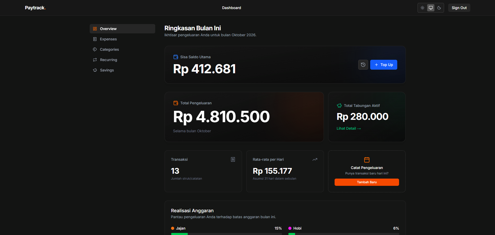
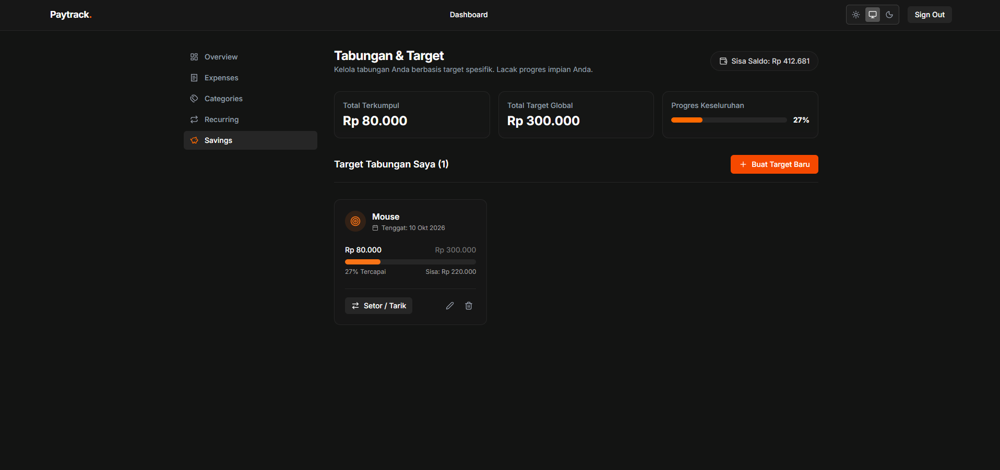
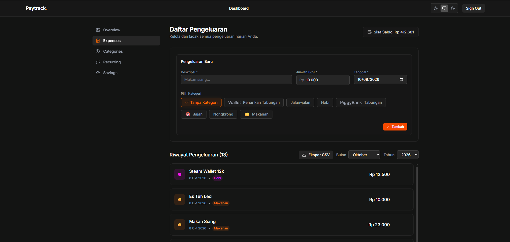
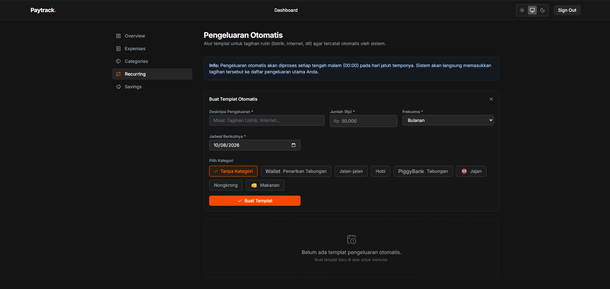
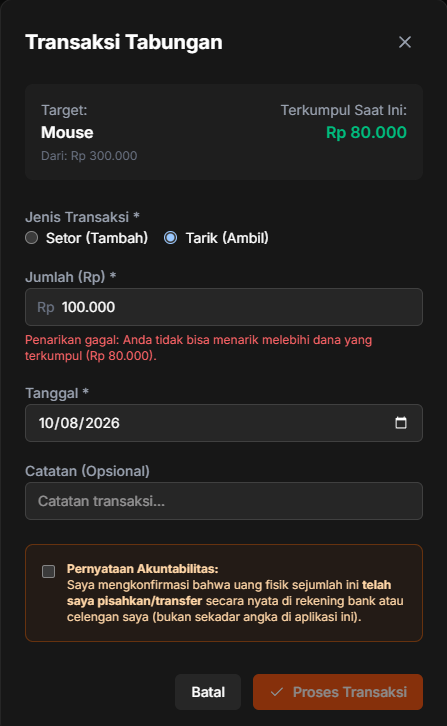
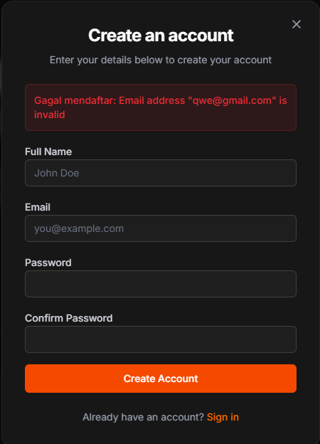

<div align="center">
  
  <h1 align="center">Paytrack</h1>
  <p align="center">
    <strong>A smart, no-nonsense personal finance and savings tracker.</strong>
  </p>
  <p align="center">
    <a href="#features">Features</a> •
    <a href="#tech-stack">Tech Stack</a> •
    <a href="#getting-started">Getting Started</a>
  </p>
</div>

<br />

> **Note:** This project is currently in active development.

Paytrack is a modern personal finance application built to solve a simple problem: keeping your actual wallet balance strictly in sync with your financial goals. Unlike standard budgeting apps that let you create imaginary money, Paytrack enforces strict accountability. If you allocate money to your savings goal, it physically deducts from your main wallet balance.

## ✨ Features

- **Strict Wallet Accountability**  
  Your main balance is calculated dynamically based on your actual top-ups (income) minus expenses and savings deposits. No more "ghost money".
  
- **Target-Driven Savings**  
  Create savings goals with specific target amounts. Every deposit you make is instantly validated against your main wallet to prevent negative balances. Once a goal hits 100%, withdrawals are locked to preserve your hard-earned money.

- **Expense Tracking & Categorization**  
  Log your daily expenses, assign custom categories (with personalized colors and icons), and track where your money goes.

- **Recurring Expenses (Subscriptions)**  
  Keep track of Spotify, Netflix, or your monthly rent.

- **Interactive Analytics**  
  Beautiful, responsive charts (built with Recharts) that show your category distributions and daily spending trends at a glance.

- **Seamless Modal Authentication**  
  A completely frictionless, modal-based login and registration flow powered by Supabase.

## 🛠️ Tech Stack

This project is built with a modern, bleeding-edge web stack:

- **Framework:** [Next.js 15](https://nextjs.org/) (App Router, Server Actions)
- **Database & Auth:** [Supabase](https://supabase.com/) (PostgreSQL, Row Level Security)
- **Styling:** [Tailwind CSS](https://tailwindcss.com/)
- **Components:** [Lucide Icons](https://lucide.dev/), [Recharts](https://recharts.org/)
- **Language:** TypeScript
- **PWA Ready:** Configured with `@serwist/next`

## 📸 Screenshots

*(Replace these placeholder links with actual screenshots of your application once deployed)*

| Dashboard Overview | Savings Management |
| :---: | :---: |
|  |  |
| Expense Management | Recurring Subscriptions |
|  |  |

| Strict Transaction Validations | Modal Authentication |
| :---: | :---: |
|  |  |


## 🚀 Getting Started

### 1. Clone the repository
```bash
git clone https://github.com/yourusername/paytrack.git
cd paytrack
```

### 2. Install dependencies
```bash
npm install
```

### 3. Set up environment variables
Create a `.env.local` file in the root directory and add your Supabase credentials:
```env
NEXT_PUBLIC_SUPABASE_URL=your_supabase_url
NEXT_PUBLIC_SUPABASE_ANON_KEY=your_supabase_anon_key
```

### 4. Run the development server
```bash
npm run dev
```
Open [http://localhost:3000](http://localhost:3000) in your browser to see the application.

## 🔒 Security

- All user data is isolated using **Supabase Row Level Security (RLS)**.
- Admin accounts have explicit `READ-ONLY` access to user metrics and cannot modify personal financial data.
- Server-side validations ensure malicious inputs cannot bypass balance constraints.

---
